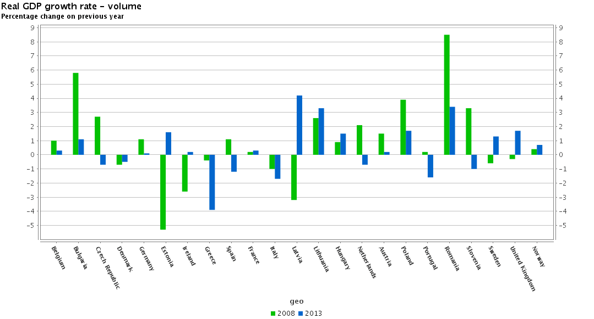

# Customers
##Facts & Trends

###Soft drink consumption in Belgium

In 2013 the Belgians consumed **1381.1 million liters of soft drinks** . This is an average of **123.9 liters a Belgian**. The biggest soda drinkers in Europe remain the Germans on average 145.2 liters per person, followed by the Belgians and the Czech Republic (resp. Average 123.9 and 123.1 liters per person). The Norwegians take third place with 117 liters.

The soft drink consumption also allocates an **increasing trend: an increase of a whopping 25.9% between 2000 and 2013**. This increase is largely attributable to the light variations among soft drinks. Between 2000 and 2013 the consumption of **regular soft drinks increased by 6.0% ** while that of the **diet soft drinks** increased by a whopping **123.4%!**

The **share of the total diet drinks** is also **increasing from 17% in 2000 to 30% in 2013**.

###Soft drink consumption in Europe

###Conclusion

There is a significant difference in the evolution of softdrink consumption over this 5 year period (2008-2013) depending on country.

The **general trend** seems to be a **reduction in sales** in Europe with the **exception of Germany, Belgium, Denmark, France, Sweden and UK.**

It's safe to say that the reduction in consumption can be largely attributed to the economic downturn. **The countries** with the **largest GDP growth rate differences** also happen to be those with the **steepest decline** in softdrink sales.

Another remarkable trend is the **rise of low-calorie drinks** which seems to indicate the consumers are more aware of the health consequences of large intake of sugar.

Over a period of 13 years we can see a 25.9% increase and for low-calorie drinks 123.4%!

Looking at these data we conclude there is **still growth in Belgium** and our direct neigboring countries which is **possitive**.

There is **more health awareness** which is also positive since a healthier softdrink alternative is one of our objectives.

* Source: [http://www.fieb-viwf.be/nl/frisdrank/frisdranken-voor-elk-wat-wils](http://www.fieb-viwf.be/nl/frisdrank/frisdranken-voor-elk-wat-wils)

* Source: [http://ec.europa.eu/eurostat](http://ec.europa.eu/eurostat/tgm/graph.do?tab=graph&plugin=1&pcode=tec00115&language=en&toolbox=sort)
